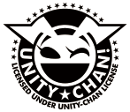

# NavigationTest

Navigetionの学習の為のプロジェクトです。  
自動で経路を探索し、目標に向かうことができます。  
  
規約により、再配布出来ないアセットがあるので、別途ダウンロードする必要があります。  
Asetts/ に以下のアセットを配置してください。  
[Standard Assets](https://assetstore.unity.com/packages/essentials/asset-packs/standard-assets-for-unity-2018-4-32351)  

# 仕様  
### MoveToTarget(Script)について  
このスクリプトをアタッチするためには、ThirdPersonCharactorとNavMeshAgentがアタッチされている必要があります。  
このスクリプトは、NavMeshAgentが求めた経路の情報をThirdPersonCharactorに橋渡しする役割を担っています。  
このスクリプトには、以下のプロパティがあります。  

| プロパティ | 説明 |
|:---|:---|
| Destination | 目標となるGameObjectです。シーン内の任意のオブジェクトを設定します。|
| Animation | 移動に合わせてアニメーションを再生するかです。 |
| Speed | 移動速度を設定します。初期値は1.5です。 |

# ライセンス
  
このプロジェクトは、[ユニティちゃんライセンス条項](https://unity-chan.com/contents/license_jp/) の元に開発されています。